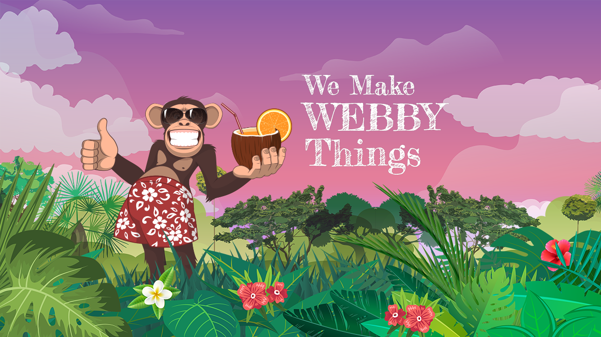

# Primitive Theme
A Headless WordPress (REST API) Theme for Frontity


Created with Node.js and React magic. 

Built on the awesome, itty bitty, Frontity framework: https://frontity.org/ 

With little help from our friends: Bootstrap 4(ohhh Bootrap 5 maybe...), GSAP and ScrollMagic. 

[Live demo: Primitive Digital](https://primitivedigital.uk)

[GitHub Repo:](https://github.com/primitiveshaun/primitivestuff)

**NB. This is a test / concept site deployment. I am intentially experimenting / trying to break it! Avaialble on AS-IS basis.**

New packages will/should be publised late 2020.
[Outadated NPM package (v1.0.x)] (https://www.npmjs.com/package/primitivestuff)

See [Frontity Theme changelog](packages/primitiveone/CHANGELOG.md) for release notes.
See [Frontity Component Library changelog](packages/primitiverocks/CHANGELOG.md) for release notes.


## [Crafted by Primitive Digital](https://primitivedigital.uk)



Setup
-----

The following pre-requisites should be in place for the theme to work:

1. WordPress install of version 5.0 or later
2. Have pretty permalinks activated

Optional
3. Register a domain
4. Set homepage to a static page (optional but I've not tried as starndard blog)
5. Posts permalink set set to: Custom Structure e.g. - `/blog/%postname%/`


If deploying to Vercel the current Frontity reccomendation is to install WordPress to a sub directory i.e. wp.example.com dedicated domain


Install and Get ur' Dev on...
------------------------------------

***Follow the Frontity setup outlined in their Docs***

https://docs.frontity.org/getting-started/quick-start-guide

***Then to use this theme***

*:: To clone the dev version from Github*

1. `git clone https://github.com/primitiveshaun/primitiveone`
2. `cd primitiveone`
3. `npm install && npx frontity dev (from the project's root directory)`


*:: To install/create the custom theme and layouts*

_ come back later

*:: To install the packages*

_ come back later


***Quick Ref: Commands ***

npx frontity dev  

npx frontity build  

- 

[To stay up-to-date >](https://docs.frontity.org/guides/keep-frontity-updated)

npx npm-check-updates -u
npm install

cd package/my-local-package
npx npm-check-updates -u
# DO NOT RUN "npm install" this time!

[See Frontity CLI Docs for more >](https://docs.frontity.org/frontity-cli)


Deployment
------------------------------------

*** Follow the Frontity deployment outlined in their Docs ***

https://docs.frontity.org/installation-and-deploy

npx now  
npx now --prod  


------------------------------------

The code is opensource so play like you mean business.

Enjoy!


#### Need Support
-------

If you find any problems with this theme, please report an issue at:  
https://github.com/primitiveshaun/primitiveone/issues

#### [Primitive One created by Primitive Digital](https://primitivedigital.uk)


#### Ω - *the end*

 > 🐒 - 🐒 - 🐒 - 🐒 - 🐒 - 🐒 - 🐒 - 🐒       
<pre>                      
._ _  _. _| _  |_    ._ _  _ ._ | o _  _  
| | |(_|(_|(/_ |_)\/ | | |(_)| ||<|(/__>  
                  /                      
</pre>
> [Mastering Markdown](https://guides.github.com/features/mastering-markdown/)


# THEME REBASED FROM 2020 july 2020

# `@frontity/twentytwenty-theme`

This project was bootstrapped with [Frontity](https://frontity.org/).

#### Table of Contents

- [Launch a development server](#launch-a-development-server)
- [Create your custom theme](#create-your-custom-theme)
- [Create a production-ready build](#create-a-production-ready-build)
- [Deploy](#deploy)

### Launch a development server

```
npx frontity dev
```

Runs the app in development mode. Open http://localhost:3000 to view it in the browser.

The site will automatically reload if you make changes inside the `packages` folder. You will see the build errors in the console.

> Have a look at our [Quick Start Guide](https://docs.frontity.org/getting-started/quick-start-guide)

### Create your custom theme

```
npx frontity create-package your-custom-theme
```

Use the command `npx frontity create-package` to create a new package that can be set in your `frontity.settings.js` as your theme

> Have a look at our blog post [How to Create a React WordPress Theme in 30 Minutes](https://frontity.org/blog/how-to-create-a-react-theme-in-30-minutes/)

### Create a production-ready build

```
npx frontity build
```

Builds the app for production to the `build` folder.

This will create a `/build` folder with a `server.js` (a [serverless function](https://vercel.com/docs/v2/serverless-functions/introduction)) file and a `/static` folder with all your javascript files and other assets.

Your app is ready to be deployed.

> Get more info about [Frontity's architecture](https://docs.frontity.org/architecture)

### Deploy

With the files generated in the _build_ you can deploy your project

#### As a node app

Use `npx frontity serve` to run it like a normal Node app.

This command generates (and runs) a small web server that uses the generated `server.js` and `/static` to serve your content

#### As a serverless service

Upload your `static` folder to a CDN and your `server.js` file to a serverless service, like Now or Netlify.

> Get more info about [how to deploy](https://docs.frontity.org/deployment) a Frontity project

---

### » Frontity Channels 🌎

We have different channels at your disposal where you can find information about the project, discuss about it and get involved:

- 📖 **[Docs](https://docs.frontity.org)**: this is the place to learn how to build amazing sites with Frontity.
- 👨‍👩‍👧‍👦 **[Community](https://community.frontity.org/)**: use our forum to [ask any questions](https://community.frontity.org/c/dev-talk-questions), feedback and meet great people. This is your place too to share [what are you building with Frontity](https://community.frontity.org/c/showcases)!
- 🐞 **[GitHub](https://github.com/frontity/frontity)**: we use GitHub for bugs and pull requests. Questions are answered in the [community forum](https://community.frontity.org/)!
- 🗣 **Social media**: a more informal place to interact with Frontity users, reach out to us on [Twitter](https://twitter.com/frontity).
- 💌 **Newsletter**: do you want to receive the latest framework updates and news? Subscribe [here](https://frontity.org/)

### » Get involved 🤗

Got questions or feedback about Frontity? We'd love to hear from you. Use our [community forum](https://community.frontity.org) yo ! ❤️

Frontity also welcomes contributions. There are many ways to support the project! If you don't know where to start, this guide might help → [How to contribute?](https://docs.frontity.org/contributing/how-to-contribute)
